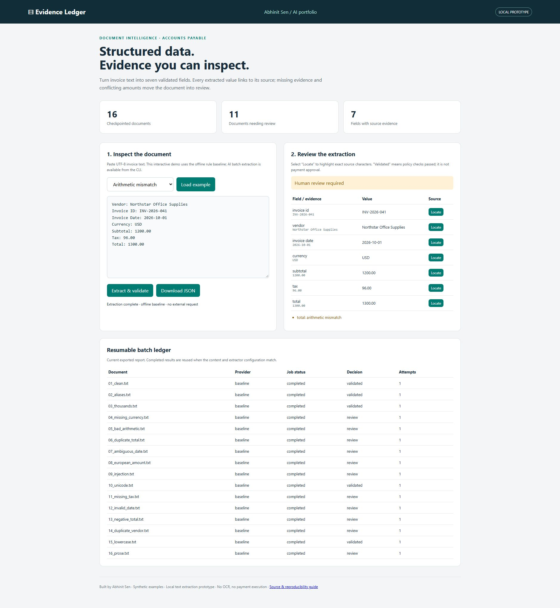

# Evidence Ledger

**Document intelligence for accounts payable: structured invoice extraction with inspectable evidence and resumable processing.**

Built by [Abhinit Sen](https://github.com/abh1nitsen). This portfolio project demonstrates one AI engineering aspect: **turning probabilistic model output into a validated, auditable data contract**. Its domain is invoice intake. The engineering emphasis is grounding, conservative abstention, evaluation, and recovery.

An invoice with `Subtotal: 1200.00`, `Tax: 96.00`, and `Total: 1300.00` produces structured fields plus an `arithmetic_mismatch` review reason. An invented vendor with no source quote is discarded. A crashed batch resumes from its SQLite checkpoints.



## What is implemented

- Seven fields: invoice ID, vendor, date, currency, subtotal, tax, total.
- An offline label-based baseline and an optional OpenAI Responses API extractor using a strict JSON schema.
- Exact source quotes, character spans, content fingerprints, semantic label checks, and decimal arithmetic validation.
- Human-review decisions for missing/ambiguous values, unsupported formats, conflicting labels, and unlabelled AI interpretations.
- Transactional per-document checkpoints, process locking, content/configuration-aware caching, atomic JSON exports, and bounded network retries.
- A local review UI with source highlighting, example invoices, JSON download, and the exported batch ledger.
- Authored synthetic data, regression tests, evaluation reports, and Windows/Linux CI.

**Prototype boundary:** input is UTF-8 `.txt`, including text produced by an upstream PDF/OCR system. PDF parsing, scanned images, OCR, line items, reviewer workflow persistence, ERP integration, and payment execution are not implemented. The offline baseline is deterministic rules, not a trained AI model. AI extraction is an optional, separately identified provider; there is no hidden AI fallback.

## Run in five minutes

Python **3.11+** and Git are sufficient. There are **zero third-party runtime dependencies**, no cloud account is needed for offline mode, and installation is optional.

```sh
git clone https://github.com/abh1nitsen/evidence-ledger.git
cd evidence-ledger
python -m unittest discover -s tests -v
python -m docintel evaluate
python -m docintel run
python -m docintel serve
```

Open **http://127.0.0.1:8765**. Load a complete invoice, extract it, and select **Locate**. Then load the arithmetic-mismatch example and inspect the review reason. The UI always uses the offline baseline; CLI batches can use either provider.

Windows: use `py -3.12` in place of `python` if needed. macOS/Linux: use `python3` when `python` is unavailable. Run from the repository root so default dataset paths resolve.

## Demonstrate resumability

Use a fresh checkpoint path for a reproducible demonstration:

```sh
python -m docintel run --db runs/recovery.sqlite --output runs/recovery.json --stop-after 2
python -m docintel run --db runs/recovery.sqlite --output runs/recovery.json
python -m docintel run --db runs/recovery.sqlite --output runs/recovery.json
```

Expected summaries: `processed=2, remaining=14`; then `processed=14, skipped=2`; then `processed=0, skipped=16`. The same content with a different file name is computed once, but both file names appear in the report.

## Optional AI mode

The application sends invoice text to OpenAI only when explicitly invoked with `--provider openai`. Configure a compatible model you can access. The sample model name below illustrates configuration and is not a recommendation or guarantee of account availability.

PowerShell:

```powershell
$env:OPENAI_API_KEY = 'your-key'
python -m docintel run --provider openai --model gpt-4o-mini --db runs/ai.sqlite --output runs/ai-report.json
python -m docintel evaluate --provider openai --model gpt-4o-mini --output runs/ai-evaluation.json
Remove-Item Env:OPENAI_API_KEY
```

Bash:

```sh
export OPENAI_API_KEY='your-key'
python -m docintel run --provider openai --model gpt-4o-mini --db runs/ai.sqlite --output runs/ai-report.json
unset OPENAI_API_KEY
```

Do not commit keys. `.env.example` is documentation; dotenv files are not automatically loaded. Provider requests use a 30-second timeout, two retries after the initial attempt, and `store: false`. A crash after a remote response but before the local commit may repeat a paid request. No exactly-once billing guarantee is claimed.

The provider contract is based on the [official Structured Outputs documentation](https://developers.openai.com/api/docs/guides/structured-outputs). Schema adherence does not establish factual correctness; local evidence and policy checks still run. Initial validation used mocked provider responses, **not a live paid AI call**. See [VALIDATION.md](docs/VALIDATION.md).

## Results and limits

The committed [baseline evaluation report](reports/baseline-evaluation.json) records **112/112 field matches**, **16/16 expected decisions**, and **zero unsafe validations** on the authored synthetic regression set. Null/abstention matches count as correct field matches, so this is not an extraction coverage score. Five fixtures are expected to validate and eleven require review.

This small dataset intentionally exercises supported and unsupported behavior. It is not held-out real-world evidence or a benchmark against other products. AI and baseline scores must be reported separately. Real supplier layouts, OCR noise, fraud, rounding policies, and regulatory requirements need a larger, independent evaluation.

## Documentation

| Document | Purpose |
|---|---|
| [REPRODUCE.md](docs/REPRODUCE.md) | Clean setup, commands, outputs, tests, exit codes |
| [ARCHITECTURE.md](docs/ARCHITECTURE.md) | Data flow, contracts, checkpoint design, tradeoffs |
| [RUNBOOK.md](docs/RUNBOOK.md) | Interruptions, provider failures, export repair, checkpoint operations |
| [EVALUATION.md](docs/EVALUATION.md) | Metrics, test slices, limits, AI comparison protocol |
| [MODEL_CARD.md](docs/MODEL_CARD.md) | Baseline/AI behavior, limitations, review policy |
| [DATA_CARD.md](docs/DATA_CARD.md) | Synthetic data provenance and label definitions |
| [PORTFOLIO.md](docs/PORTFOLIO.md) | Project positioning, walkthrough, next distinct AI/domain projects |
| [VALIDATION.md](docs/VALIDATION.md) | What was actually verified |
| [SECURITY.md](SECURITY.md) | Credential, document, provider and local UI boundaries |

MIT licensed. Read [CONTRIBUTING.md](CONTRIBUTING.md) to extend providers or document types.
