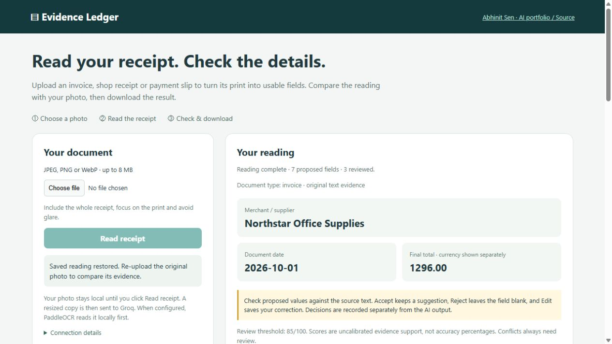
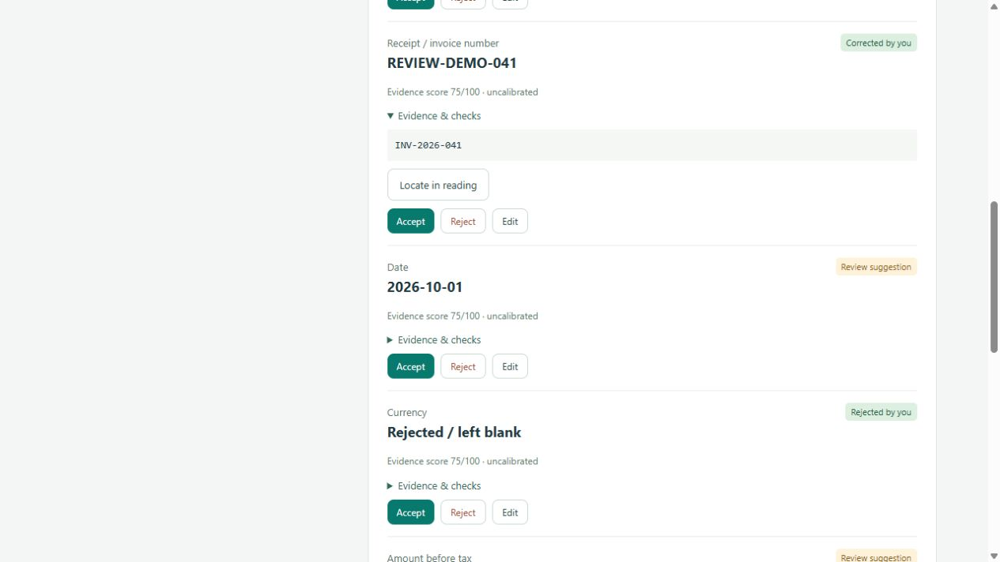

# Evidence Ledger

**Document intelligence for accounts payable: structured invoice extraction with inspectable evidence and resumable processing.**

Built by [Abhinit Sen](https://github.com/abh1nitsen). This portfolio project demonstrates one AI engineering aspect: **turning probabilistic model output into a validated, auditable data contract**. Its domain is invoice intake. The engineering emphasis is grounding, conservative abstention, evaluation, and recovery.

An invoice with `Subtotal: 1200.00`, `Tax: 96.00`, and `Total: 1300.00` produces structured fields plus an `arithmetic_mismatch` review reason. An invented vendor with no source quote is discarded. A crashed batch resumes from its SQLite checkpoints.



## What is implemented

- Seven common fields plus optional transaction time, base amount and tip, with invoice/retail-receipt/payment-slip roles.
- An offline label-based baseline, optional OpenAI text extraction, and Groq text/vision extraction.
- Invoice photo upload (JPEG, PNG, WebP), orientation correction, metadata removal, bounded image preparation, and conservative image review.
- Exact source quotes, character spans, content fingerprints, semantic label checks, and decimal arithmetic validation.
- Visible suggestions with uncalibrated evidence scores and durable Accept / Reject / Edit decisions; source, label and format conflicts remain explicit.
- Transactional per-document checkpoints, process locking, content/configuration-aware caching, atomic JSON exports, and bounded network retries.
- A local review UI with source highlighting, example invoices, JSON download, and the exported batch ledger.
- Authored synthetic data, regression tests, evaluation reports, and Windows/Linux CI.

**Prototype boundary:** input is UTF-8 `.txt` or a single JPEG/PNG/WebP invoice image. Groq vision transcribes photographed/scanned invoices and extracts fields. PDF parsing, HEIC/TIFF, line items, ERP integration, and payment execution are not implemented. The offline baseline is deterministic rules, not a trained AI model. There is no hidden AI fallback.

## Run in five minutes

Python **3.11+** and Git are sufficient for the dependency-free offline text demo. Image mode additionally needs Pillow (the `vision` extra) and a Groq API key.

```sh
git clone https://github.com/abh1nitsen/evidence-ledger.git
cd evidence-ledger
python -m unittest discover -s tests -v
python -m docintel evaluate
python -m docintel run
python -m docintel serve
```

Open **http://127.0.0.1:8765**. Expand **Try an offline text example**, use the complete invoice and click **Read text**. Open its supporting text and choose **Locate in reading**. Then try the arithmetic-mismatch example. Text examples run offline; photo uploads use Groq when configured.

Windows: use `py -3.12` in place of `python` if needed. macOS/Linux: use `python3` when `python` is unavailable. Run from the repository root so default dataset paths resolve.

## Demonstrate resumability

Use a fresh checkpoint path for a reproducible demonstration:

```sh
python -m docintel run --db runs/recovery.sqlite --output runs/recovery.json --stop-after 2
python -m docintel run --db runs/recovery.sqlite --output runs/recovery.json
python -m docintel run --db runs/recovery.sqlite --output runs/recovery.json
```

Expected summaries: `processed=2, remaining=14`; then `processed=14, skipped=2`; then `processed=0, skipped=16`. The same content with a different file name is computed once, but both file names appear in the report.

## Optional AI mode

### Groq invoice photos

Create a virtual environment, install the vision extra and set the server-side key. PowerShell:

```powershell
python -m venv .venv
.\.venv\Scripts\python.exe -m pip install -e ".[vision]"
$env:GROQ_API_KEY = (Get-Content -Raw 'PATH_TO_YOUR_GROQ_KEY_FILE').Trim()
.\.venv\Scripts\python.exe -m docintel serve --vision-model qwen/qwen3.8-27b
```

Bash: activate a virtual environment, run `python -m pip install -e '.[vision]'`, export `GROQ_API_KEY`, then run the same `serve` command with `python`. The key stays on the server and is never sent to the browser. Model availability can change; use a vision-capable model listed in your account and [Groq's vision documentation](https://console.groq.com/docs/vision).

Open http://127.0.0.1:8765, choose **Upload invoice image**, inspect the local preview, then click **Read receipt**. Only that click sends a metadata-stripped normalized copy to Groq. Results show the model transcription, fields, source quotes, quality issues and a persisted checkpoint. Uploading identical bytes again reuses a completed result. Every image result requires human review against the original; quotes/spans refer to the model transcription, **not verified pixel locations**.

Camera advice: include the whole page, keep the phone approximately parallel to the invoice, focus on the print, use diffuse natural light, and avoid glare/strong shadows. Natural light is supported as an input condition, **not a guarantee for every photo or invoice**. Unreadable or ambiguous fields abstain. Unsupported dates/amounts/layouts can still require manual entry.

For resumable mixed text/image batches:

```sh
python -m docintel run --input YOUR_INVOICE_FOLDER --provider groq --db runs/groq.sqlite --output runs/groq-report.json
python -m docintel run --input YOUR_INVOICE_FOLDER --provider groq --db runs/groq.sqlite --output runs/groq-report.json --retry-failed
python -m docintel evaluate --images --dataset data/images --provider groq --output runs/image-evaluation.json
```

Use the virtual-environment Python executable on Windows. Supported images are at most **8,000,000 bytes / 20 megapixels**, single-frame, and at least 32 pixels on both sides. Images are normalized to upright RGB JPEG with a longest edge of 2,000 pixels. No perspective correction or separate independent OCR is claimed.

Groq uses JSON object mode with independent schema validation, a 45-second per-request timeout, and at most two retries. Rate-limit retries honor numeric `Retry-After`, capped at 60 seconds per delay; otherwise wait 20 seconds. There is no silent provider/model switch. See [IMAGE_INPUT.md](docs/IMAGE_INPUT.md) for evidence, privacy, quality and recovery boundaries.

### OpenAI text extraction

The application sends invoice text to OpenAI only when explicitly invoked with `--provider openai`. Configure a compatible model you can access. The sample model name below illustrates configuration and is not a recommendation or guarantee of account availability.

PowerShell:

```powershell
$env:OPENAI_API_KEY = 'your-key'
python -m docintel run --provider openai --model gpt-4o-mini --db runs/ai.sqlite --output runs/ai-report.json
python -m docintel evaluate --provider openai --model gpt-4o-mini --output runs/ai-evaluation.json
Remove-Item Env:OPENAI_API_KEY
```

Bash:

```sh
export OPENAI_API_KEY='your-key'
python -m docintel run --provider openai --model gpt-4o-mini --db runs/ai.sqlite --output runs/ai-report.json
unset OPENAI_API_KEY
```

Do not commit keys. `.env.example` is documentation; dotenv files are not automatically loaded. Provider requests use a 30-second timeout, two retries after the initial attempt, and `store: false`. A crash after a remote response but before the local commit may repeat a paid request. No exactly-once billing guarantee is claimed.

The OpenAI provider contract is based on the [official Structured Outputs documentation](https://developers.openai.com/api/docs/guides/structured-outputs). Schema adherence does not establish factual correctness. OpenAI remains mock-tested; Groq vision has a separately recorded live synthetic smoke test. See [VALIDATION.md](docs/VALIDATION.md).

## Results and limits

The committed [baseline evaluation report](reports/baseline-evaluation.json) records **112/112 field matches**, **16/16 expected decisions**, and **zero unsafe validations** on the authored synthetic regression set. Null/abstention matches count as correct field matches, so this is not an extraction coverage score. Five fixtures are expected to validate and eleven require review.

This small dataset intentionally exercises supported and unsupported behavior. It is not held-out real-world evidence or a benchmark against other products. AI and baseline scores must be reported separately. Real supplier layouts, OCR noise, fraud, rounding policies, and regulatory requirements need a larger, independent evaluation.

## Documentation

| Document | Purpose |
|---|---|
| [REPRODUCE.md](docs/REPRODUCE.md) | Clean setup, commands, outputs, tests, exit codes |
| [ARCHITECTURE.md](docs/ARCHITECTURE.md) | Data flow, contracts, checkpoint design, tradeoffs |
| [RUNBOOK.md](docs/RUNBOOK.md) | Interruptions, provider failures, export repair, checkpoint operations |
| [EVALUATION.md](docs/EVALUATION.md) | Metrics, test slices, limits, AI comparison protocol |
| [MODEL_CARD.md](docs/MODEL_CARD.md) | Baseline/AI behavior, limitations, review policy |
| [DATA_CARD.md](docs/DATA_CARD.md) | Synthetic data provenance and label definitions |
| [PORTFOLIO.md](docs/PORTFOLIO.md) | Project positioning, walkthrough, next distinct AI/domain projects |
| [VALIDATION.md](docs/VALIDATION.md) | What was actually verified |
| [IMAGE_INPUT.md](docs/IMAGE_INPUT.md) | Photo upload, Groq configuration, transcription evidence and limitations |
| [SECURITY.md](SECURITY.md) | Credential, document, provider and local UI boundaries |

MIT licensed. Read [CONTRIBUTING.md](CONTRIBUTING.md) to extend providers or document types.

## Using the receipt reader

Choose a photo, click **Read receipt**, then compare the merchant, date, total and seven detailed fields with your original. **Enlarge photo** opens a larger view; **Evidence & checks** reveals evidence, and **Locate in reading** highlights matching transcription characters. **Not confirmed** is an abstention, not a zero. Rejected model suggestions remain separate from usable values. A successful reading still needs human confirmation; the yellow notice is not an API failure. Currency is independent of amounts: `$14.09` can become `14.09` while the currency stays unknown. Download JSON when ready. Text examples and the sample batch ledger are secondary views. See [the UI walkthrough](docs/UI_GUIDE.md).

## Independent OCR and saved human review

```sh
python -m pip install -e ".[ocr]"
# Set GROQ_API_KEY in your environment; never paste it into source or the browser.
python -m docintel serve --port 8765 --ocr paddle --review-threshold 0.85
```

PaddleOCR runs locally on CPU with pinned PP-OCRv5 mobile detection/recognition models; Groq interprets field roles using the photo and independent OCR text. The first OCR run downloads weights and takes longer. Model files and OCR caches stay under ignored `runs/ocr/`. No automatic fallback hides OCR failures; omit `--ocr paddle` to explicitly use Groq-only extraction.

The evidence score is **uncalibrated**, not an accuracy percentage. The configurable 0.85 threshold is provisional and only highlights review needs; it never auto-approves image results. Conflicts force review regardless of score. **Accept**, **Reject** and **Edit** save separate human decisions while preserving the original AI output. **Resume a saved reading** restores them after restart. Re-upload the original photo to inspect OCR crops, because original uploads are not retained. Download JSON includes `effective_fields`, original candidates, scores and decision history. A bare `$` is ambiguous; explicit `S$` maps to SGD. Two-digit dates propose a century but require confirmation. A payment slip's BASE amount stays separate when TOTAL is blank.

See [OCR and review details](docs/OCR_AND_REVIEW.md) and [the validation record](docs/VALIDATION.md). To reproduce the layout comparison:

```sh
python scripts/benchmark_documents.py --ocr none --db runs/groq-diversity.sqlite --output runs/groq-diversity.json
python scripts/benchmark_documents.py --ocr paddle --db runs/hybrid-diversity.sqlite --output runs/hybrid-diversity.json
```

The three authored invoice, retail and payment-slip layouts measure **proposed** fields and absent-field behavior separately. These are regression examples, not a real-photo generalisation benchmark or confidence calibration dataset.



## Spending groups and phone capture

Save an editable receipt category and tags, then use the spending overview to compare reviewed totals by category, currency and month. A tentative keyword suggestion never confirms a group automatically. Totals and currency must be explicitly reviewed; BASE is not a substitute for TOTAL. The responsive UI includes a separate rear-camera capture control. Phone access still requires a reachable backend; this release stays loopback-only. See [spending and mobile guide](docs/SPENDING_AND_MOBILE.md) for semantics, duplicate handling and practical access options.
