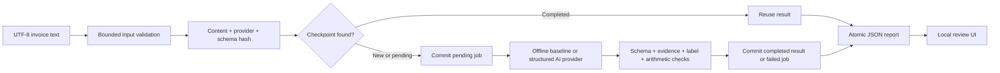

# Architecture

## Modules

`core.py` owns the shared JSON schema, normalization, source verification, and review policy. `providers.py` implements interchangeable extraction methods. `pipeline.py` owns durable state and export. `evaluate.py` scores the authored labels. `server.py` serves an offline demo on loopback. The UI loads exported reports; it does not expose batch execution or the AI key.

Version 0.2 also adds `vision.py` for bounded image preparation and transcription validation. The UI exposes a Groq image-upload endpoint with server-side credentials and durable upload checkpoints. Image keys include original bytes, image provider prompt/schema/configuration, preprocessing revision and Pillow version. Image spans refer to model-generated transcription and always require review; they are not pixel evidence. See `IMAGE_INPUT.md` for the full image flow.

## Output contract

Provider output is seven objects with `value` and `quote`, each string or null. Validated output includes normalized value, exact quote, `start`/`end` spans, and `valid`. Spans index Unicode code points in the **decoded source text**, with the end exclusive. The UI converts these to JavaScript UTF-16 indices. Quotes must match the complete raw value, not a whole passage.

Amounts use Decimal and accept supported leading currency markers without inferring the currency. Dates accept ISO `YYYY-MM-DD` or unambiguous numeric day/month or month/day dates, optionally followed by a time. Eight explicit currency codes are supported. Negative amounts, locale-ambiguous separators, exponents, and values over 1 billion require review. This intentionally excludes credit notes and some legitimate invoices.

Quotes must have a token-bounded occurrence. This prevents a tax amount such as `96.00` from being confused with the substring of `1296.00`, while repeated equal values retain their extracted value and up to 32 candidate source spans, conservatively requiring review. The legacy single `span` is null for repeated evidence. Rejected suggestions are stored separately in `candidate` and `candidate_quote`; the usable `value` remains null. A labelled field must agree with its matching source label. An AI value from unlabelled prose can retain its source evidence, but triggers `semantic_binding_needs_review`.

Grounding supports traceability, not proof that the supplier or invoice is authentic. Document-instruction detection is a small diagnostic rule, not a complete security classifier. AI mode has no tools and treats source text as untrusted data.

## Persistence and recovery

Jobs are keyed by SHA-256 of the source-content hash, provider identity, and validation schema version. Baseline identity contains an implementation revision; AI identity contains model name, prompt and output schema. Changes to extraction or review policy must bump the relevant revision. Provider keys are never included.

States are `pending`, `completed`, and `failed`. Completion includes both `validated` and `review` decisions. A review is a successful extraction needing human attention, not a failed job.

The process commits `pending` before calling the provider and commits result/error afterward. An interrupted pending job is retried on the next run. A completed job is reused. A failed job is reused until `--retry-failed` is supplied. Input failures are rechecked each run and do not receive checkpoint keys, since valid content was not obtained.

SQLite uses WAL, `synchronous=FULL`, and transaction boundaries. A nonblocking OS lock serializes access to each database and releases automatically on process death. This is a single-host, single-worker design; network filesystems and distributed workers are outside scope. Different databases can execute independently; do not have them share an output path.

Exports use a flushed/fsynced temporary file in the destination directory and `os.replace`. The database is authoritative: if export fails, resume regenerates the report without repeating completed extraction. Directory metadata is not explicitly fsynced, so power-loss guarantees vary by filesystem/OS. SQLite damage, disk loss and hardware failure require backups.

The report includes only files discovered in the current run; old checkpoint results remain in the database. If a file is changed during discovery/processing, that run represents the bytes read; rerun with a stable input directory for a complete snapshot. `--stop-after` writes a partial report with a nonzero `remaining` count.

## Provider failures

HTTP 429 and selected 5xx responses, network errors, and timeouts have a bounded retry budget. Permanent authentication errors, refusal, malformed output, and incomplete generation do not silently switch to the baseline. Sanitized error categories are checkpointed; provider bodies and source documents are never emitted to command logs.

Remote execution is at least once after a local crash: an already-paid remote response may not have reached the checkpoint. Local completed results are reused, but remote billing is not exactly once. Current reports do not store actual resolved model snapshot, usage, latency, or response ID. For a production experiment, add those metadata and select fixed model versions where available.

## OCR and human-review extension (0.4)

`ocr.py` executes optional pinned CPU PaddleOCR in a subprocess with a 180-second deadline. The worker receives no Groq/OpenAI environment key and returns bounded text, scores and normalized-image boxes. OCR output is validated and atomically cached by normalized image hash/config/library identity; downloaded weight hashes are recorded and checked on reuse. The hybrid extraction key includes weight hashes and OCR package versions. OCR failure is explicit, never a silent fallback. PaddleOCR caches and weights live in ignored `runs/ocr/`. Groq uses independent OCR evidence; its own transcript cannot overwrite the grounding source.

`documents.py` attaches document type, optional time/base/tip fields and explainable score components. Image proposals with two-digit-year assumptions, mismatched evidence or blank/conflicting labels remain review-only. BASE never becomes TOTAL automatically. Core seven-field text provider contracts remain compatible; the image envelope now requires type and additional fields. See `OCR_AND_REVIEW.md` for score weights and limits.

`reviews.py` keeps immutable extraction snapshots in a separate SQLite WAL/FULL database and appends Accept/Reject/Edit events. A transaction with a checked revision rejects stale concurrent changes with HTTP 409. Re-registering a checkpoint restores decisions instead of overwriting them. Human decisions populate `effective_fields`; original `fields[].value`, candidates, evidence and scores are preserved. Decisions belong to a specific extraction identity, not automatically to a later changed model/configuration result. GET saved readings and attachment exports reflect the latest revision. The loopback server uses request threads so a long OCR/model request does not block reading existing reviews; image pipeline writers still use the OS-held database lock.
