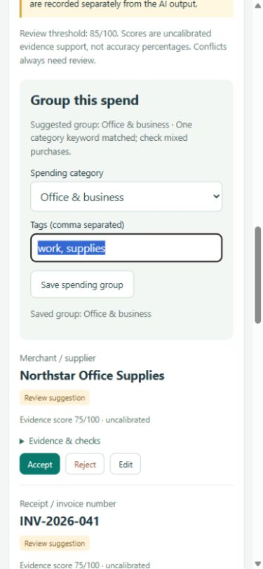

# Document reader walkthrough

1. Choose a JPEG, PNG or WebP image under 8 MB. Previewing stays local. In OCR mode, the photo is read locally and a normalized copy plus OCR text is sent to Groq when you click **Read receipt**.
2. Inspect document type and the ten common/optional fields. A payment slip can lack tax or final total. A BASE amount is kept separate; missing print stays absent rather than being inferred.
3. Low-scoring candidates remain visible. Scores are uncalibrated evidence support, not correctness probabilities; the configurable default threshold is 85/100. Conflicts and century assumptions always need review.
4. **Evidence & checks** shows the quote, reasons and independent OCR photo crops where available. **Locate in reading** highlights source characters. **Enlarge photo** opens the whole original for comparison. OCR and AI can both misread print.
5. **Accept** takes the normalized proposal; **Reject** leaves the effective value blank; **Edit** saves a correction. Two-digit years require explicit confirmation, and edited dates use a four-digit ISO year. Missing candidates have no Accept button.
6. Decisions save automatically. **Resume a saved reading** restores them after restart; re-upload the original to inspect photo crops. Original suggestions remain unchanged. Concurrent stale decisions reload the latest revision and ask you to retry.
7. Download JSON with original machine fields, scores, `effective_fields` and review history. Human-reviewed arithmetic mismatches remain flagged. Review does not authorize payment.

A bare $ does not confirm currency; S$ is an explicit SGD marker, although OCR may misread it. Such cases remain visible suggestions requiring photo inspection. Failed reading or failed saving shows an error; existing decisions remain stored.

The offline text demo is a secondary view. Developer diagnostics are available through the CLI/API rather than the receipt screen. Original private photos, transcripts, OCR caches and review histories do not belong in public Git fixtures or screenshots.

## Group spending

Use **Group this spend** to confirm a category and add comma-separated tags. Suggestions are tentative keyword matches, not AI confidence estimates. **Save spending group** persists these separately from printed fields. Accept or edit the total and currency before the receipt enters **Spending overview**. Review the date to place it in a monthly group. Each currency has separate totals; excluded/duplicate receipts are counted in the notes. Mixed baskets use reviewed item categories when line items reconcile with the final total. No-item receipts use the saved receipt category.

Panels, long field values, review badges and saved-reading selectors wrap at narrow widths. Mobile uses a single column. **Take a bill photo** asks compatible phone browsers for the rear camera; upload remains available. See [spending and smartphone access](SPENDING_AND_MOBILE.md) for backend access options and present limitations.

## Compact review and multiple photos

Use **Details**, **Items** and **Review** inside the results pane. Select one row to expand its evidence and actions. The review queue opens unresolved rows. **Spending** opens a separate view. The desktop panes stay equal in height and scroll internally; mobile stacks them and offers **Hide photo**.

On **Items**, compare the printed abbreviation/code and proposed readable name with the photo. Category/name inference can be wrong even if the amount is grounded. **Accept suggestion**, **Reject item**, and **Save correction** create saved audit events. Specify which purchase a discount reduces, or explicitly choose its category if it applies to a basket. Review payment/tax rows too. An unresolved amount mismatch blocks item spending.

Read one photo first. Click **Add next page**, choose its photo and click **Read receipt**. Repeat in top-to-bottom order, ideally with a small overlap showing continuity. Use page arrows and **Save page order** after rearranging; **Remove** detaches a page without erasing its original saved reading. Possible duplicated overlap rows require your decision. **Start new receipt** clears the active workspace; saved readings remain. Restoring a chain restores decisions and provenance, but use each page’s **Attach photo** button to inspect its original pixels. See [the chain contract](ITEMS_AND_PAGES.md).
